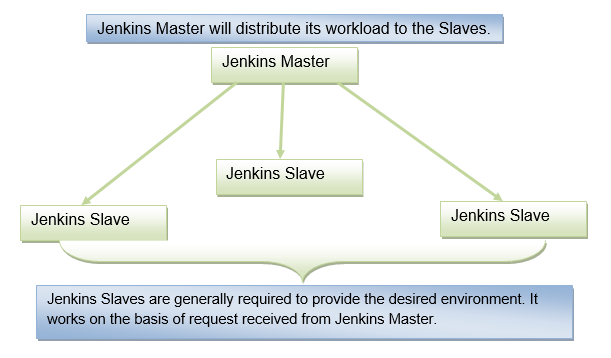

# Jenkins Architecture

Jenkins follows Master-Slave architecture to manage distributed builds. In this architecture, slave and master communicate through TCP/IP protocol.

Jenkins architecture has two components:

- Jenkins Master/Server
- Jenkins Slave/Node/Build Server

## Jenkins Master
The main server of Jenkins is the Jenkins Master. It is a web dashboard which is nothing but powered from a war file. By default it runs on 8080 port. With the help of Dashboard, we can configure the jobs/projects but the build takes place in Nodes/Slave. By default one node (slave) is configured and running in Jenkins server. We can add more nodes using IP address, user name and password using the ssh, jnlp or webstart methods.

The server's job or master's job is to handle:

- Scheduling build jobs.
- Dispatching builds to the nodes/slaves for the actual execution.
- Monitor the nodes/slaves (possibly taking them online and offline as required).
- Recording and presenting the build results.
- A Master/Server instance of Jenkins can also execute build jobs directly.

## Jenkins Slave
Jenkins slave is used to execute the build jobs dispatched by the master. We can configure a project to always run on a particular slave machine, or particular type of slave machine, or simple let the Jenkins to pick the next available slave/node.

As we know Jenkins is developed using Java is platform independent thus Jenkins Master/Servers and Slave/nodes can be configured in any servers including Linux, Windows, and Mac.

